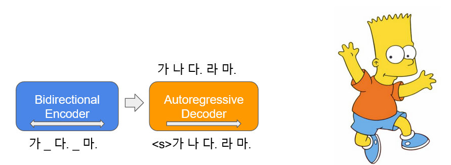
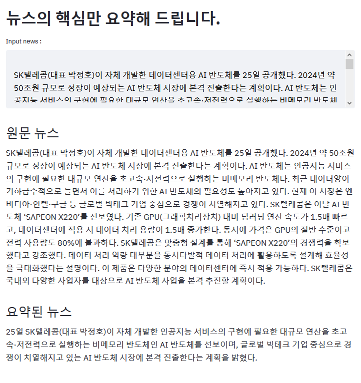

# 🤣 KoBART

* [🤣 KoBART](#-kobart)
  * [How to install](#how-to-install)
  * [Data](#data)
  * [Tokenizer](#tokenizer)
  * [Model](#model)
    * [Performances](#performances)
      * [Classification or Regression](#classification-or-regression)
      * [Summarization](#summarization)
  * [Demos](#demos)
  * [Examples](#examples)
  * [Release](#release)
  * [Contacts](#contacts)
  * [License](#license)

[**BART**](https://arxiv.org/pdf/1910.13461.pdf)(**B**idirectional and **A**uto-**R**egressive **T**ransformers)는 입력 텍스트 일부에 노이즈를 추가하여 이를 다시 원문으로 복구하는 `autoencoder`의 형태로 학습이 됩니다. 한국어 BART(이하 **KoBART**) 는 논문에서 사용된 `Text Infilling` 노이즈 함수를 사용하여 **40GB** 이상의 한국어 텍스트에 대해서 학습한 한국어 `encoder-decoder` 언어 모델입니다. 이를 통해 도출된 `KoBART-base`를 배포합니다.



## How to install

```bash
pip install git+https://github.com/SKT-AI/KoBART#egg=kobart
```

## Data

| Data         | # of Sentences |
| ------------ | -------------: |
| Korean Wiki  |             5M |
| Other corpus |          0.27B |

한국어 위키 백과 이외, 뉴스, 책, [모두의 말뭉치 v1.0(대화, 뉴스, ...)](https://corpus.korean.go.kr/), [청와대 국민청원](https://github.com/akngs/petitions) 등의 다양한 데이터가 모델 학습에 사용되었습니다.

## Tokenizer

[`tokenizers`](https://github.com/huggingface/tokenizers) 패키지의 `Character BPE tokenizer`로 학습되었습니다.

`vocab` 사이즈는 30,000 이며 대화에 자주 쓰이는 아래와 같은 이모티콘, 이모지 등을 추가하여 해당 토큰의 인식 능력을 올렸습니다.
> 😀, 😁, 😆, 😅, 🤣, .. , `:-)`, `:)`, `-)`, `(-:`...

또한 `<unused0>` ~ `<unused99>`등의 미사용 토큰을 정의해, 필요한 `subtasks`에 따라 자유롭게 정의해 사용할 수 있게 했습니다.

```python
>>> from kobart import get_kobart_tokenizer
>>> kobart_tokenizer = get_kobart_tokenizer()
>>> kobart_tokenizer.tokenize("안녕하세요. 한국어 BART 입니다.🤣:)l^o")
['▁안녕하', '세요.', '▁한국어', '▁B', 'A', 'R', 'T', '▁입', '니다.', '🤣', ':)', 'l^o']
```

## Model

| Model         | # of params |  Type   | # of layers | # of heads | ffn_dim | hidden_dims |
| ------------- | :---------: | :-----: | ----------: | ---------: | ------: | ----------: |
| `KoBART-base` |    124M     | Encoder |           6 |         16 |    3072 |         768 |
|               |             | Decoder |           6 |         16 |    3072 |         768 |

```python
>>> from transformers import BartModel
>>> from kobart import get_pytorch_kobart_model, get_kobart_tokenizer
>>> kobart_tokenizer = get_kobart_tokenizer()
>>> model = BartModel.from_pretrained(get_pytorch_kobart_model())
>>> inputs = kobart_tokenizer(['안녕하세요.'], return_tensors='pt')
>>> model(inputs['input_ids'])
Seq2SeqModelOutput(last_hidden_state=tensor([[[-0.4418, -4.3673,  3.2404,  ...,  5.8832,  4.0629,  3.5540],
         [-0.1316, -4.6446,  2.5955,  ...,  6.0093,  2.7467,  3.0007]]],
       grad_fn=<NativeLayerNormBackward>), past_key_values=((tensor([[[[-9.7980e-02, -6.6584e-01, -1.8089e+00,  ...,  9.6023e-01, -1.8818e-01, -1.3252e+00],
```

### Performances

#### Classification or Regression

|                 | [NSMC](https://github.com/e9t/nsmc)(acc) | [KorSTS](https://github.com/kakaobrain/KorNLUDatasets)(spearman) | [Question Pair](https://github.com/aisolab/nlp_classification/tree/master/BERT_pairwise_text_classification/qpair)(acc) |
| --------------- | ---------------------------------------- | ---------------------------------------------------------------- | ------------------------------------------------------------------------------------
----------------------------------- |
| **KoBART-base** | 90.24                                    | 81.66                                                            | 94.34                                                                                                                   |

#### Summarization

* 업데이트 예정 *

## Demos

* [요약 데모](https://huggingface.co/spaces/gogamza/kobart-summarization)



*위 예시는 [ZDNET 기사](https://zdnet.co.kr/view/?no=20201125093328)를 요약한 결과임*

## Examples

* [NSMC Classification](https://github.com/SKT-AI/KoBART/tree/main/examples)
* [KoBART ChitChatBot](https://github.com/haven-jeon/KoBART-chatbot)
* [KoBART Summarization](https://github.com/seujung/KoBART-summarization)
* [KoBART Translation](https://github.com/seujung/KoBART-translation)
* [LegalQA using Sentence**KoBART**](https://github.com/haven-jeon/LegalQA)
* [KoBART Question Generation](https://github.com/Seoneun/KoBART-Question-Generation)

*KoBART를 사용한 흥미로운 예제가 있다면 PR주세요!*

## Release

* v0.5.1
  * guide default 'import statements'
* v0.5
  * download large files from `aws s3`
* v0.4
  * Update model binary
* v0.3
  * 토크나이저 버그로 인해 `<unk>` 토큰이 사라지는 이슈 해결
* v0.2
  * `KoBART` 모델 업데이트(서브테스트 sample efficient가 좋아짐)
  * `모두의 말뭉치` 사용 버전 명시
  * downloder 버그 수정
  * `pip` 설치 지원

## Contacts

`KoBART` 관련 이슈는 [이곳](https://github.com/SKT-AI/KoBART/issues)에 올려주세요.

## License

`KoBART`는 `modified MIT` 라이선스 하에 공개되어 있습니다. 모델 및 코드를 사용할 경우 라이선스 내용을 준수해주세요. 라이선스 전문은 `LICENSE` 파일에서 확인하실 수 있습니다.
